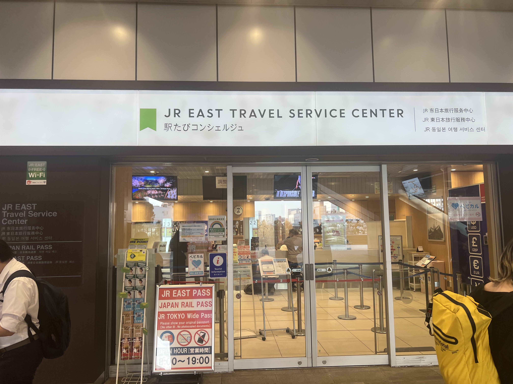
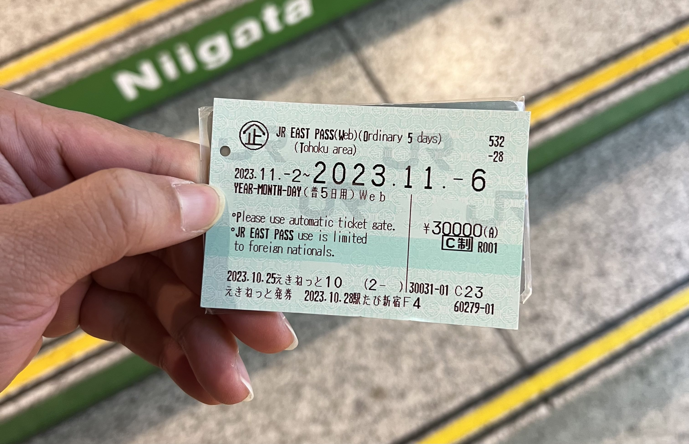

## Về vé JR East Pass

JR East Pass đại khái là một loại vé cho phép người ngoài quốc tịch Nhật (dù là lưu trú ngắn hạn hay dài hạn) được sử dụng không giới hạn hệ thống tàu shinkansen, tàu cao tốc, một số tàu local và hệ thống JR Bus thuộc khu vực Tohoku trong 5 ngày liên tiếp với giá vé tại thời điểm 10/2023 là ¥30,000 cho 1 người lớn.

Thông tin tham khảo thêm:

- Chi tiết về JR East Pass: [link here](https://www.jreast.co.jp/multi/en/pass/eastpass_t.html)
- Một số loại vé tương tự do JR East Railway Company cung cấp: [link here](https://www.jreast.co.jp/multi/en/pass/)

## Why JR East Pass?

- Tiền ít cho dịch vụ ngon
  - Tính đơn giản nếu bạn muốn đi Aomori từ Tokyo bằng shinkansen, vé một chiều đã là ¥17,620, x2 cho vé khứ hồi là ¥35,240¥ > ¥30,000 JR East Pass (thời điểm 10/2023). JR East Pass còn xài được liên tiếp 5 ngày, đi bao nhiêu tuỳ thích, với hầu như toàn bộ hệ thống tàu và bus của JR. Quá hời 💰
- Di chuyển linh hoạt, không cần phải đặt chỗ trước cho tàu Shinkansen
  - Tàu Shinkansen khu vực Tohoku đa phần đều là reserved-seat (ghế phải đặt trước) nên mình khuyến khích các bạn đặt chỗ trước khi lên tàu. Tuy nhiên trong trường hợp bạn có một lịch trình linh hoạt, không ngại đứng thì bạn vẫn có thể quá giang ở lối hành lang ra vào. Nếu hên, trong đoạn đường kế tiếp có ghế trống thì nhân viên tàu cũng có thể sẽ sắp xếp cho bạn một chỗ ngả lưng.

## Mua và lấy vé JR East Pass

### Mua

- Mua online trên trang của JR Pass, thanh toán bằng thẻ credit: [link here](https://www.jreast.co.jp/multi/en/pass/eastpass_t.html)
- Mua offline tại quầy bán vé: [link here](https://www.jreast.co.jp/multi/en/pass/eastpass_t.html#:~:text=Purchasing%20at%20a%20ticket%20office%20in%20Japan)
- Mua thông qua đại lý bán vé: [link here](https://www.jreast.co.jp/multi/en/pass/eastpass_t.html#:~:text=Purchasing%20a%20pass%20from%20a%20travel%20agency%20in%20another%20country)

### Lấy vé

Trường hợp bạn mua vé online hoặc thông qua đại lý, bạn cần đến trực tiếp tại quầy để lấy vé.

- Danh sách địa điểm lấy vé: [link here](https://www.jreast.co.jp/e/ticketwindow/?selectPass=eastT)
- Tài liệu mang theo
  - Passport để chứng minh bạn là người ngoại quốc.
  - Bằng chứng bạn đã mua vé (mã QR hoặc voucher mua vé).

Lưu ý: vé sẽ không được cấp lại trong trường hợp bạn đánh mất hoặc làm hỏng vé.

Ví dụ lần mình đi Tohoku vào 10/2023 thì mình lấy vé tại [quầy ở Shinjuku](https://maps.app.goo.gl/8nyQHqtnd1epjAhG6)

Quầy vé

Vé sau khi lấy

## Sử dụng vé

### Khi đi tàu

Sử dụng như vé đi tàu thông thường

### Khi đi bus

Bạn chỉ cần show vé cho nhân viên xe bus trước khi lên và sau khi xuống xe Bus. Lưu ý vé chỉ sử dụng được cho hệ thống bus vận hành bởi JR.

## Sắp xếp lịch trình dựa theo vé JR East Pass

Nếu bạn chưa biết đi đâu và đi như thế nào với vé JR East Pass, bạn hoàn toàn có thể tham khảo lịch trình do JR East Railway Company chuẩn bị sẵn ([link here](https://www.jreast.co.jp/multi/en/pass/eastpass_t.html#:~:text=Recommended%20places%20to%20visit%20in%20this%20area)). Những địa điểm được gợi ý này đa phần đều có thể tiếp cận bằng tàu hoặc JR Bus sử dụng JR East Pass.

## Kết

Trên đây là một số thông tin mình tổng hợp được liên quan đến JR East Pass. Chúc các bạn có một chuyến đi vui vẻ!! ⛩️
