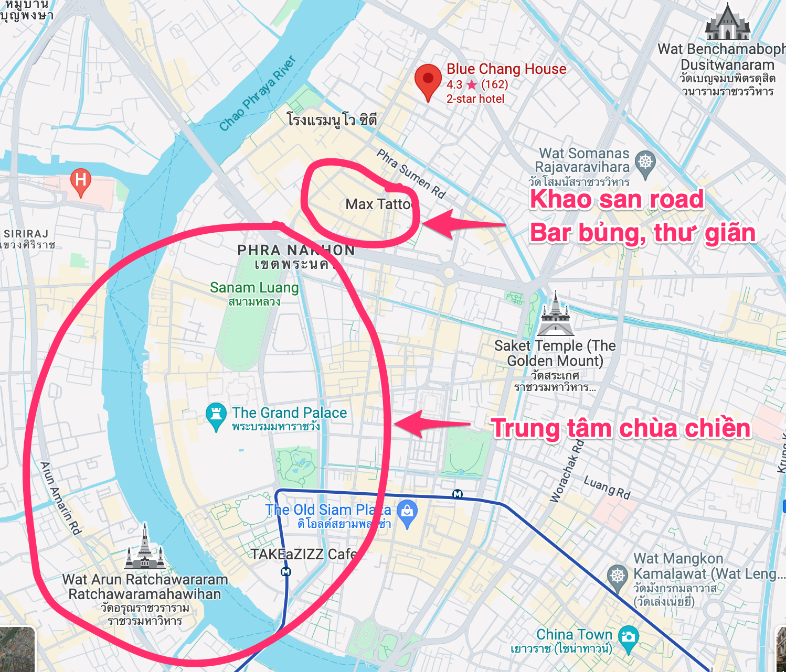
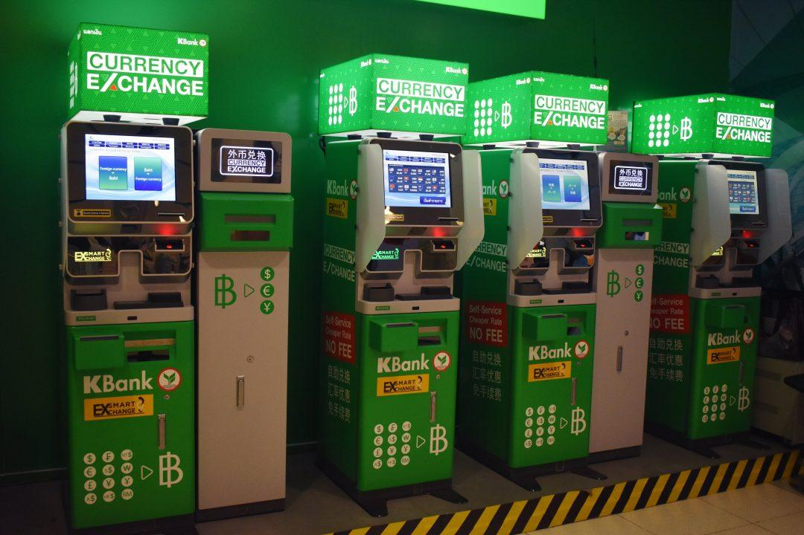
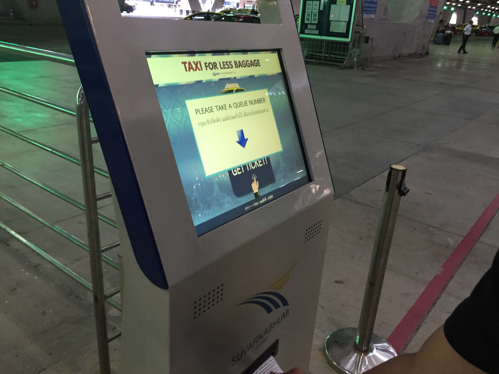

## Tổng quan

Bài viết note lại một vài kinh nghiệm của mình trong chuyến du lịch Bangkok cuối tháng 1 năm 2024.  
_Lưu ý: nội dung tập trung vào truyền đạt thông tin, nên các chi tiết văn vẻ sẽ được lược bớt :)_

## Chuẩn bị trước khi đến Bangkok

### Passport (Hộ chiếu)

- Công dân Việt Nam có hộ chiếu sẽ được miễn visa nhập cảnh Thái Lan và được lưu trú trong vòng 30 ngày
- Điều kiện: hộ chiếu cần có hiệu lực ít nhất 6 tháng kể từ thời điểm nhập cảnh vào Thái Lan.

Nguồn tham khảo: [Thư Viện Pháp Luật](https://thuvienphapluat.vn/phap-luat-doanh-nghiep/cau-hoi-thuong-gap/hien-nay-di-thai-lan-co-can-ho-chieu-khong-4215.html#:~:text=C%C3%B4ng%20d%C3%A2n%20Vi%E1%BB%87t%20Nam%20c%C3%B3,tr%C3%BA%20kh%C3%B4ng%20qu%C3%A1%2015%20ng%C3%A0y.)

### Book phòng

- Giá phòng ở Bangkok khá tương đồng với VN, tuỳ theo loại hình và chất lượng mà giá cả có thể chênh lệch khác nhau.
- Ưu tiên của mình là gần khu trung tâm, chùa chiền.
- Hôm mình đi 2 người, book Blue Chang House 3 đêm, giá 2400 Baht (~1636k), tính ra chưa đến 300k/người/đêm. Phòng tương đối sạch sẽ, đủ dùng. Máy sấy và sữa tắm hôm mình ở không được đặt sẵn trong phòng nhưng bảo người ta thì người ta vẫn mang cho. Host thân thiện, nói được một chút tiếng anh.

  - [Blue Chang House trên booking.com](https://www.booking.com/Share-niHI2T)
  - [Map](https://maps.app.goo.gl/MN3dF8ZS7dPSbM9u6): 2.2km tới Grand Place. Vị trí phòng tính ra cũng không thuận lợi để tới trạm xe bus trung chuyển hay khu skyline của Bangkok lắm. Mình tò mò khu Khao San Road nên mới book ở đấy, cơ mà tốt hơn thì nên book ở mạn phía đông của Grand Palace một chút.

  

## Đáp sân bay

Bangkok có 2 sân bay: [Don Mueang](https://maps.app.goo.gl/bJkcNhZ6GkK1FPG77) ở phía Bắc và [Suvarnabhumi International Airport (BKK)](https://maps.app.goo.gl/cifeEi9pfNWremX48) ở phía Tây. Sân bay mình đáp là **Suvarnabhumi International Airport**, đây cũng là sân bay chính tiếp nhận các lượt khách quốc tế.

### Nhập cảnh

- Thời gian từ đáp sân bay đến hoàn thành thủ tục nhập cảnh cớ 45p ~ 1h30p, tuỳ lượng khách. Hôm mình đi, chờ cỡ 1h.
- Thủ tục cơ bản nhanh gọn, tuy nhiên xếp hàng chờ nhập cảnh tương đối lâu.

### Đổi tiền

Bạn có thể đổi tiền tại sân bay bằng một trong 2 hình thức: 

- **Quầy Money Exchange**: Quầy mình hỏi chỉ chấp nhận mua bán tiền mặt, không chấp nhận rút thẻ. Mình rút thẻ nên được chuyển qua sử dụng ATM. Tỉ giá đổi tại các quầy là khác nhau, **quầy ở tầng B1F (tầng có tàu điện) tỉ giá tốt hơn một xíu**. Xem thêm tại [link youtube](https://www.youtube.com/watch?v=EeJlR7RiJsI&ab_channel=DESIYATRI)

- **ATM**: đặt đầy ở sân bay. Tỉ giá mình rút là `1 vnd = 0.001307 baht` thấp hơn tỉ giá Google `1 vnd = 0.0014`, tỉ lệ ~= 93.4% (28/01/2024). Phỉ rút là 220 Baht

  

### Mua Sim

Shop bán sim ngay cạnh các quầy đổi tiền. Mình mua sim của nhà mạng AIS, gói 299 Bath, 8G tốc độ cao/7 ngày. Hết tốc độ cao xài 364kbs/s, xài tẹt.

_Tip: sim mới nên có thể tạo tài khoản Grab mới để hưởng ưu đãi dịch vụ_

### Di chuyển về khách sạn

Từ sân bay vào trung tâm thành phố có thể di chuyển bằng 3 hình thức chính: Taxi, Bus hoặc Tàu điện. Giá tàu điện là rẻ và tiết kiệm nhất. 
Hôm mình đi với bạn, cả 2 đã thấm mệt nên chọn Taxi. Bãi đón Taxi ở tầng 1, mua vé ở cây bán máy tự động, tìm taxi với số tương ứng rồi đi thôi. Tiền sẽ được tính bằng Meter. Hôm mình đi hết 710 Baht cho quãng đường ~36km + cao tốc.

## Trong thành phố

### Di chuyển

Trong thành phố thì mình di chuyển bằng 3 phương tiện chính

- **Taxi**: êm ái thoải mái, tuy nhiên khả năng lách đường lúc tắc kém nhất.
- **TukTuk (must try)**: trải nghiệm cảm giác đường phố Bangkok, thoáng mát, dễ lách đường, tuy nhiên một số ông chạy ẩu cũng hơi rén. Đi TukTuk thì phải mặc cả, giá mặc cả giao động: `1 Grab bike < TukTuk < tổng số người x 1 Grab bike` với quãng đường tương tự. VD: hôm mình đi thì mình mặc cả cỡ 100-120 Baht cho quãng đường 4-5km. Mặc cả vui là chính, nên hạn chế mặc cả đến nỗi 2 bên lên xe không nhìn mặt nhau :).
- **Grab bike**: nhanh nhất, khả năng lách đường tốt nhất. Đi bike bên Thailand không cần đội mũ. Mình ngồi xe có đúng một lần mà gặp ngay ổng trẻ lạng lách đánh võng thấy ghê :).

Ngoài ra, Bankok cũng có hệ thống thuyền đưa đón dọc bờ sông.

## Tham quan thăm thú.

| Địa điểm                                                            | For                        | Memo                                                                                                                                                     |
| ------------------------------------------------------------------- | -------------------------- | -------------------------------------------------------------------------------------------------------------------------------------------------------- |
| [The Grand Palace](https://maps.app.goo.gl/7SWWqLUS5F2yCRkn9)       | Culture, Buddhism          | vé 500 Baht/người                                                                                                                                        |
| [Wat Pho](https://maps.app.goo.gl/iz6smPmJSisQFjtv6)                | Culture, Buddhism          | Vé 300 Baht/người                                                                                                                                        |
| [Wat Arun](https://maps.app.goo.gl/EYHS2fRdXogkfD887)               | Culture, Buddhism          | Mình không đi chùa này, mà chỉ ngồi quán roof top phía bên kia bở để ngắm hoàng hôn                                                                      |
| [Khao San Road](https://maps.app.goo.gl/txTf14wmnyTY8wTM7)          | Bar, night time, relax     | Cảm nhận cá nhân là hơi ồn ào, ngột ngạt                                                                                                                 |
| [China town](https://maps.app.goo.gl/dGdHm9PFoJycYABj8)             | Food, shopping, night time | Mình đi buổi ngày không có gì, buổi tối chắc vui hơn                                                                                                     |
| [Jodd Fairs](https://maps.app.goo.gl/3VVvENVByNwJN7Tn8)             | Food, shopping, night time | Náo nhiệt, nhiều đồ ăn ngon, đáng đi                                                                                                                     |
| [Pattaya](https://maps.app.goo.gl/aHZfhdujL9mdpKaU7)                | Lady boi                   | Cách Bangkok chừng 2h30p đi bus. Mua vé bus tại bến xe [Ekkamai Bus Terminal](https://maps.app.goo.gl/dWzCcAcjRgvZL19C7). Nên check lịch xe trước khi đi |
| [Chợ nổi DaSaduakSaduak](https://maps.app.goo.gl/He7eynGbjsdzezbx6) |                            | Chưa có thời gian đi. Có thể tìm tour trên mạng                                                                                                          |

## Chi phí tạm tính.

Mình đi 2 ngày 3 đêm, tổng chi phí + mua quà cỡ gần 10,000 Baht (tiêu sạch số tiền rút). Cỡ 7tr vnd :)).
